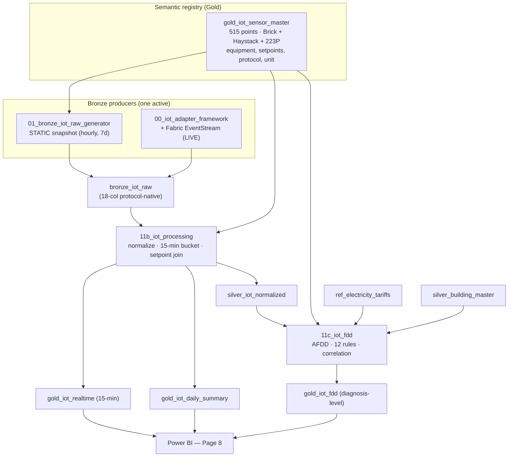

# IoT Monitoring & Fault Detection (AFDD) — Page 8 Architecture

**Status:** Production-grade (static snapshot live; streaming mode designed)
**Layers:** Bronze → Silver → Gold (Delta / Microsoft Fabric Lakehouse)
**Standards:** Brick Schema · Project Haystack · ASHRAE 223P · ASHRAE Guideline 36 (AFDD) · EN 16798 · WELL

---

## 1. Overview

Page 8 is the platform's real-time **IoT monitoring and Automated Fault Detection &
Diagnostics (AFDD)** module. It turns raw building-automation telemetry into
ranked, actionable equipment diagnoses — the capability that distinguishes
sector-leading BMS analytics (Schneider EcoStruxure, Siemens Desigo, Clockworks)
from simple threshold dashboards.

The IoT stack runs in **two interchangeable modes** that share the same Silver/Gold
contract, so Power BI and the web app are identical regardless of source:

| Mode | Source of `bronze_iot_raw` | When | Cost |
|---|---|---|---|
| **Static snapshot** | `01_bronze_iot_raw_generator` notebook | Demos, sales, trial-expired periods | Compute on demand only |
| **Live streaming** | `00_iot_adapter_framework` + Fabric EventStream | Production with real sensors | Continuous capacity |

Both feed `11b_iot_processing` (Silver + 15-min Gold) and `11c_iot_fdd` (AFDD).
Switching modes requires no change downstream — only which producer writes Bronze.

---

## 2. Data flow



---

## 3. Semantic layer — `gold_iot_sensor_master`

The semantic registry is the meaning layer for every sensor point. It follows the
2026 industry direction of harmonizing **Brick Schema** (point classes), **Project
Haystack** (marker tags) and **ASHRAE 223P** (equipment/connection semantics).
Generated by `notebooks/iot/00_iot_sensor_master_generator.py` → **515 points across
10 buildings**.

Each point carries: `building_id`, `sensor_id`, `sensor_type`, `sensor_location`,
`floor`, `zone`, `equipment_ref`, `equipment_type`, `brick_class`, `haystack_tags`,
`point_group`, `reading_unit`, `source_protocol`, `setpoint_min/max`,
`alert_threshold_low/high`, `baseline_value`, `vendor_model`.

`point_group` drives the AFDD correlation granularity:

| point_group | Examples | Located at | Correlation scope |
|---|---|---|---|
| `iaq_comfort` | HVAC_temp, humidity, CO2, VOC, PM2.5/PM10, CO, lux, dB | zone (`Floor-n-ZoneA`) | per zone |
| `occupancy` | occupancy_pir, people_count | zone | per zone |
| `energy` | building_kwh, hvac_kwh, lighting_kwh, plug_load_kwh, power_factor | main meter | per building |
| `hvac_equip` | supply/return/chilled-water temp, COP, boiler_eff, pump dP, filter dP, valve/damper/fan | equipment (`AHU-1`, `Chiller-1`…) | per equipment |
| `water` / `renewable_ev` | water_flow, leak, PV, battery SoC, EV charger | meter / plant | per building |

~31 sensor types span IAQ, occupancy, energy sub-metering, HVAC equipment telemetry
(G36), water and renewables/EV.

---

## 4. Protocol interoperability

The registry assigns a realistic protocol + vendor per sensor type, demonstrating
full multi-protocol ingestion (a Phase 2 differentiator). Nine protocols are
represented:

| Protocol | Standard | Typical points | Example vendor |
|---|---|---|---|
| BACnet/IP | ASHRAE 135 | HVAC temps, valves, dampers, filter dP | Siemens Desigo |
| Modbus/TCP | IEC 61158 | electrical meters, boiler, pump | Schneider PM |
| KNX | ISO/IEC 14543 | lighting / illuminance | ABB i-bus |
| MQTT 5.0 | ISO/IEC 20922 | people count, PV, battery | Generic MQTT |
| OPC-UA | IEC 62541 | chiller COP, fan VFD | Beckhoff |
| LoRaWAN | — | CO2, CO, leak | Milesight |
| Zigbee | IEEE 802.15.4 | VOC, PM, occupancy, sound | Aqara |
| M-Bus | EN 13757 | water flow | Kamstrup |
| OCPP/MQTT | OCPP 2.0.1 | EV charger | ABB Terra |

`bronze_iot_raw.source_protocol` preserves the native protocol per reading so the
normalized layer can prove provenance.

---

## 5. Medallion layers

### 5.1 Bronze — `bronze_iot_raw` (protocol-native)

Raw, per-reading telemetry in a fixed **18-column schema** that both producers must
match exactly (the static generator was validated byte-for-byte against the schema
read by `11b`):

| # | Column | Type | Notes |
|---|---|---|---|
| 1 | device_id | string | = sensor_id from registry |
| 2 | building_id | string | FK |
| 3 | sensor_type | string | |
| 4 | sensor_location | string | zone / equipment / main-meter |
| 5 | reading_value | float | |
| 6 | reading_unit | string | °C, %RH, ppm, kW, … |
| 7 | source_protocol | string | native protocol |
| 8 | timestamp | string | `yyyy-MM-dd'T'HH:mm:ss'Z'` |
| 9 | reading_quality | int | 0–100 (drops on wireless dropout) |
| 10–12 | setpoint_min / max / baseline_value | float | from registry |
| 13–17 | in_setpoint, is_anomaly, anomaly_type, anomaly_severity, action_recommended | bool/string | self-consistent; **11b recomputes** these from the registry setpoints |
| 18 | cost_eur_estimate | float | coarse placeholder; the authoritative cost is computed in 11c |

**Static generator** (`01_bronze_iot_raw_generator.py`): reads the 515-point registry
and produces an **hourly, ~7-day** series ending at *now*. Value model:

- **Occupancy-driven diurnal** signal per building profile (office / hotel /
  always-on). Profiles set the daily rhythm only — they do **not** assign a
  city/identity (avoids cross-page identity drift).
- Sensors stay **inside their setpoint band by default**; anomalies arise from
  (a) realistic comfort noise (= `Medium`, "outside ideal setpoint") and
  (b) injected faults (= `High`, alarm-threshold breach). No systematic
  out-of-band values during unoccupied periods → no false anomalies.
- **Fault injection** is run-time-independent: each incident targets the *most
  recent K matching hours* (not a fixed `hours_ago` window), so signatures appear
  regardless of which weekday the notebook runs. 12 incidents seed all 12 AFDD
  fault codes plus single-sensor threshold anomalies.

Target outcome (validated): anomaly rate **~7%** in the 50-hour window that 11b
validates (engine expects 5–30%), schema identical to 11b.

### 5.2 Silver — `silver_iot_normalized` (`11b_iot_processing.py`)

- Parses `timestamp`, filters to a **lookback window** (`lookback_hours`, default 2 —
  set to **50** for the static snapshot).
- Buckets readings to **15-minute** windows (`ts_bucket`).
- Joins `gold_iot_sensor_master` to apply canonical setpoints and **recomputes**
  `in_setpoint`, severity, `is_anomaly` and the action text from the registry
  (the Bronze values are only a fallback). Anomaly rate is therefore driven by
  *reading vs registry setpoint*, not by what Bronze claims.

### 5.3 Gold

| Table | Grain | Purpose (Page 8) |
|---|---|---|
| `gold_iot_realtime` | 15-min × building × sensor_type × location | C1 power, C2/V3 setpoint compliance, V1 24h trend, cost window |
| `gold_iot_daily_summary` | day × building × sensor_type | uptime matrix (V2), daily compliance, daily cost |
| `gold_iot_fdd` | **diagnosis** (building × scope × fault × day) | V5 FDD findings, C4 fault/cost card |

---

## 6. AFDD engine — `11c_iot_fdd.py` (v3)

The AFDD engine is the core differentiator. It goes beyond single-sensor thresholds:
it **correlates multiple sensors at the same building and time** to diagnose faults
(ASHRAE Guideline 36 family + APAR-style rules), then assigns each diagnosis a
**confidence**, **priority** and **probable cause**.

### 6.1 Correlation model (the key design)

Sensors live at different locations: zone temp/CO2 at the zone, supply/return at the
AHU, `hvac_kwh` at the main meter. A naive pivot on `sensor_location` can never put
them in the same row, so power-coupled rules (low-ΔT, ventilation, setpoint-not-met)
would never fire. The engine therefore correlates at **three granularities** and
**broadcasts the building-level meter signals** (`hvac_kwh`, `building_kwh`,
`power_factor`) onto the zone and equipment frames:

- **Zone frame** — `groupBy(building, sensor_location, ts)` + building meter context
- **Equipment frame** — `groupBy(building, equipment_ref, ts)` + building meter context
- **Building frame** — `groupBy(building, ts)` for meter-only rules

### 6.2 Rule catalogue (frozen taxonomy)

| # | fault_code | Scope | Trigger (correlated) | Severity |
|---|---|---|---|---|
| 1 | SETPOINT_NOT_MET | Zone | zone temp beyond 20–24 °C **±2 deadband** while building HVAC at high load | Medium |
| 2 | VENTILATION_FAULT | Zone | CO2 > 1400 ppm while HVAC active (EN 16798 IDA-4) | High |
| 3 | IAQ_PARTICULATE | Zone | PM2.5 > 35 or PM10 > 50 µg/m³ (WELL / EN 16798) | Medium |
| 4 | LOW_DELTA_T | AHU | \|supply − return\| < 5 °C while HVAC active | Medium |
| 5 | SUPPLY_AIR_TEMP_FAULT | AHU | supply outside 12–16 °C **±2** while fan running | Medium |
| 6 | FILTER_LOADING | AHU | filter ΔP > 300 Pa | Medium |
| 7 | COP_DEGRADATION | Chiller | chiller COP < 2.5 | High |
| 8 | CHW_TEMP_FAULT | Chiller | chilled-water outside 6–10 °C | Medium |
| 9 | BOILER_EFF_DEGRADATION | Boiler | boiler efficiency < 75 % | High |
| 10 | PUMP_PRESSURE_FAULT | Pump | pump ΔP outside 150–350 kPa | Medium |
| 11 | AFTER_HOURS_HVAC | Building | night (22–05) **+ scheduled building_type** + HVAC > 0.5 × baseline | High |
| 12 | POWER_FACTOR_LOW | Building | power factor < 0.85 | Medium |

**Noise suppression (G36 practice).** Comfort/equipment rules use **deadbands** (fault
threshold ≠ comfort setpoint) and a **persistence timer** (`occurrence_count ≥ 2` per
day): a single transient window is not a diagnosis. This keeps the high-severity card
clean while still logging everything for ranking.

**After-hours scheduling.** AFTER_HOURS uses the **static `building_type`** to decide
which buildings have a schedule (Office / Retail / Education = scheduled; Hotel /
Healthcare / Data_Center / Lab / Logistics = 24/7 → excluded — legitimate night
operation is not a fault). An earlier window-derived load profile was discarded
because the 50-hour analysis window can fall entirely on a weekend, making a
scheduled office look 24/7. The occupied-level threshold uses the registry HVAC
baseline (window-independent), not a value derived from the same short window.

### 6.3 Diagnosis-level output + scoring

Window findings are aggregated to **one row per (building, scope, fault_code, day)** —
the diagnosis a facility manager acts on, with `first_seen` / `last_seen` and
`occurrence_count` (persistence):

- **confidence** = `0.4·persistence + 0.4·magnitude + 0.2·data_quality` (floor 0.3),
  where persistence = `min(occurrence_count / 8, 1)` and magnitude = normalized
  exceedance beyond threshold.
- **priority_score** (0–100) = `100 · severity_weight · confidence · (0.5 + 0.5·cost_norm)`,
  with severity_weight High 1.0 / Medium 0.6 / Low 0.3 — surfaces sustained,
  high-cost High faults at the top of the queue.
- **energy_impact_kwh** = `power_waste_kw × occurrence_count × reading_interval_h`.
- **cost_eur_estimate** = `energy_impact_kwh × grid_price`, where `grid_price` is the
  country rate from `ref_electricity_tariffs` (single source of truth — audit fix H1,
  no hard-coded €/kWh).

All logic uses native Spark expressions (no UDFs — audit fix H3, Catalyst-friendly).

---

## 7. Limitations & assumptions (stated honestly)

- **Economizer fault and simultaneous heating/cooling are intentionally NOT
  implemented.** They require an outdoor-air temperature sensor and split
  heating/cooling valve telemetry that are not in the current sensor set. They are
  deferred to **Phase 2.5** rather than inferred from data that does not exist.
- **Static snapshot is synthetic.** The generator models realistic diurnal,
  occupancy and fault behaviour but is not measured data. The Silver/Gold contract
  is identical to live mode, so the snapshot is for demos and trial-expired periods.
- **Bronze `cost_eur_estimate` is a coarse placeholder.** The authoritative,
  country-priced cost is computed in `11c` from `ref_electricity_tariffs`.
- **HVAC sub-metering split** elsewhere in the platform (Page 7) is a type-coefficient
  model; Page 8 uses measured `hvac_kwh` from the registry meter.
- **AFTER_HOURS depends on `building_type`** being one of the scheduled types; an
  unknown/missing type is treated as non-scheduled (no false positive).

---

## 8. Page 8 integration (Power BI)

`gold_iot_fdd` is **backward-compatible**: it preserves every column the existing
DAX v59 measures read, and adds richer columns for a future v60.

| | Columns |
|---|---|
| **Preserved (DAX v59 works unchanged)** | `fdd_rule`, `severity`, `description`, `recommended_action`, `cost_eur_estimate`, `event_date` |
| **New (DAX v60 + V5 table)** | `fault_code`, `equipment`, `equipment_type`, `confidence`, `priority_score`, `probable_cause`, `occurrence_count`, `energy_impact_kwh`, `first_seen`, `last_seen` |

Page 8 layout:

- **C1** real-time building power (kW) vs baseline · **C2** zone setpoint compliance %
  (EN 16798, from `in_setpoint`) · **C3** CO2 status · **C4** high-severity faults +
  estimated € today.
- **V1** 24h power trend (`building_kwh` + `hvac_kwh` + baseline) · **V2** sensor
  uptime matrix · **V3** zone compliance · **V5** FDD findings table sorted by
  `priority_score` (equipment + fault_code + confidence % + Est. €).

Add `gold_iot_realtime` and `gold_iot_fdd` to the model with relationships
`building_id → silver_building_master` and `event_date → 'Date'[Date]`.

---

## 9. Pipeline & run order

Static-snapshot refresh (manual or scheduled):

1. `00_iot_sensor_master_generator` — once (or when the sensor topology changes).
2. `01_bronze_iot_raw_generator` — writes `bronze_iot_raw`. Params: `gen_days` (7),
   `seed` (42), `noise_scale` (1.0).
3. `11b_iot_processing` — **set `lookback_hours = 50`** (default 2 is a gotcha).
   Produces `silver_iot_normalized`, `gold_iot_realtime`, `gold_iot_daily_summary`.
4. `11c_iot_fdd` — produces `gold_iot_fdd`. Param: `reading_interval_h` (1.0 for the
   hourly snapshot; 0.25 for a 15-min live feed).

**Operational notes**

- Every notebook needs a **default Lakehouse pinned** (bare `saveAsTable` otherwise
  fails with "No default lakehouse").
- **Schema evolution:** when a producer's output type/columns change, drop the target
  first (`DROP TABLE IF EXISTS …`) so Delta `mergeSchema` does not fail on a
  type mismatch (e.g. a prior `double` vs a new `float`). 11c drops `gold_iot_fdd`
  itself; for 11b's three outputs, drop them before the run.
- Order matters: 11c depends on `silver_iot_normalized`, so it runs after 11b.

---

## 10. Transition to live mode

The live path replaces only the Bronze producer:

```
Sensors → protocol adapters (00_iot_adapter_framework)
        → Fabric EventStream → bronze_iot_raw (Delta + optional KQL hot path)
        → 11b_iot_processing (scheduled, e.g. every 15 min)
        → 11c_iot_fdd → gold_iot_fdd
```

The adapter framework normalizes each protocol to standard units before EventStream
ingest. Because Silver/Gold are identical to the static path, Power BI and the web
app require no change — only the scheduled refresh and the streaming capacity are
enabled. Switching back to the snapshot (e.g. after a trial) simply re-runs the
generator.

---

## 11. Standards referenced

| Domain | Standard |
|---|---|
| Semantic modelling | Brick Schema · Project Haystack · ASHRAE 223P |
| Fault detection | ASHRAE Guideline 36 · APAR (AHU Performance Assessment Rules) |
| Indoor air quality | EN 16798 (IDA classes) · WELL (PM) |
| Thermal comfort | EN 16798 Category II (20–24 °C) |
| Protocols | ASHRAE 135 (BACnet) · IEC 61158 (Modbus) · ISO/IEC 20922 (MQTT) · IEC 62541 (OPC-UA) · EN 13757 (M-Bus) · OCPP 2.0.1 |

---

*Files: `notebooks/iot/00_iot_sensor_master_generator.py`,
`01_bronze_iot_raw_generator.py`, `11b_iot_processing.py`, `11c_iot_fdd.py`,
`00_iot_adapter_framework.py`. DAX: `semantic-model/71_dax_v59_iot_fdd_and_fixes.dax`.*
